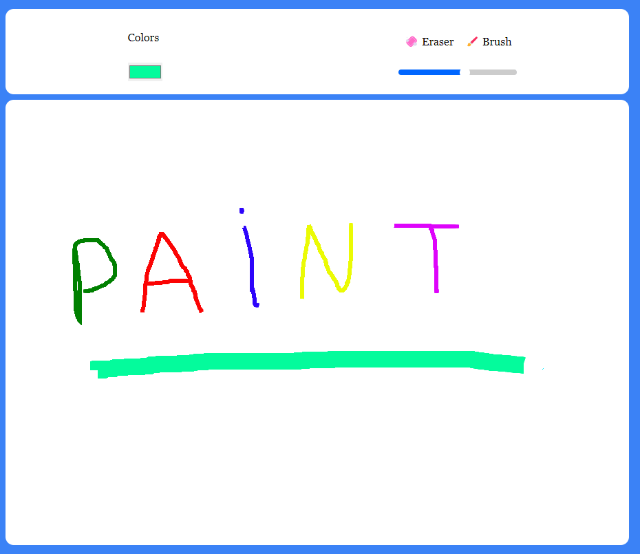

# Paint App 🎨

This simple Paint application allows users to draw and showcase their creativity. The project features basic drawing tools, and users can choose from different colors and brush sizes.

## Screenshots 📸
<div style="display: flex; flex-direction: row;">
    
</div>

## Features ✨

- **Drawing Tools ✏️🖌️**: Ability to draw with various tools like pen, brush, fill, etc.
- **Color Selection 🎨**: Users can choose from different colors.
- **Brush Size Adjustment 🖌️**: Different brush sizes can be selected for drawing.
- **Save and Share 💾📤**: Drawings can be saved and optionally shared on social media platforms.

## Technologies Used 💻


- 💻 [React.js](https://reactjs.org/) - JS library for crafting user interfaces
- 📦 [Vite](https://vitejs.dev/) - Module bundler
- 🎨 [Tailwind CSS](https://tailwindcss.com/) - A utility-first CSS framework
- 🌐 [Netlify](https://www.netlify.com/) - Hosting service for static web apps

## Install & Build 🔧

Prerequisites

- Install Node.js ⚙️
- Clone the repo 🔄

📦 After cloning the repo install dependecies with

 ```sh 
  npm i
```
📡 To run development server use dev script
 ```sh 
  npm run dev
```
🔧 To build use build script
 ```sh 
  npm run build
```
after running scripts go to http://localhost:5173 with your browser to use the app. 🌐

  ## Demo  🌐
 [paint-app.netlify.app](https://vite-paint-app.netlify.app/) 


## License 📄

[MIT](https://choosealicense.com/licenses/mit/)
